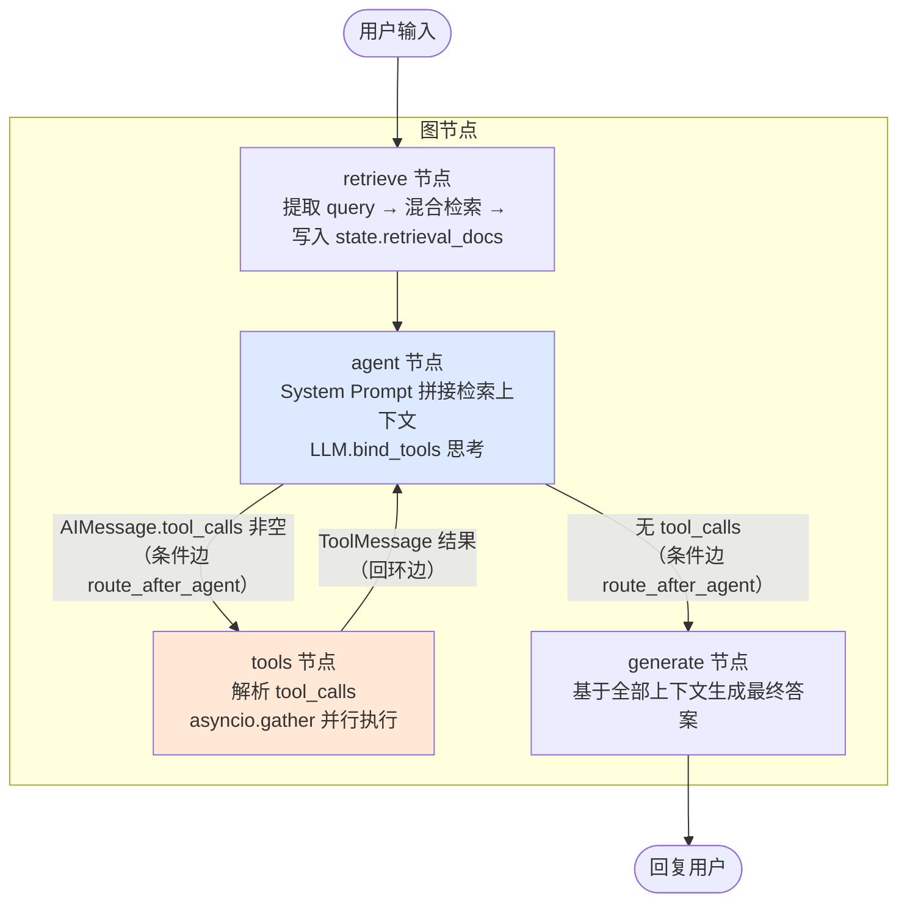

# FinancialAssistant（finrag）

基于 **Python 3.14 / LangGraph** 的 **RAG + Tool Calling 复合 Agent** 示例项目，
面向"可直接上桌面试"的企业级落地标准构建。LLM 使用 **DeepSeek API**，
Embedding 使用 **阿里云百炼 DashScope（text-embedding-v3）**。

> 本文件是**项目门面与参考手册**（为什么做、怎么跑、特性、实测数据、FAQ）；
> 想按步骤读代码、做实验，请看 [docs/PROJECT_GUIDE.md](docs/PROJECT_GUIDE.md)（学习地图）。

## 文档导航

| 文档 | 受众 | 内容 |
|------|------|------|
| **README.md**（本文件） | 所有人 | 项目总览、快速上手、架构、压测与评估数据 |
| [docs/](docs/README.md) | 学习者 / 面试准备 | 文档中心：学习地图、概念术语、思考与方案答辩归档 |
| [AGENTS.md](AGENTS.md) | AI 助手 / 协作者 | 开发约定、质量门禁、类型检查陷阱 |

## 特性一览（AI Agent 上岗五要素）

| 要素 | 实现 |
|------|------|
| 工程韧性 | 全链路 async/await；工具调用失败友好降级；LLM 请求级重试 + 超时；`@trace` 耗时打点支持 P99 复盘 |
| RAG 全链路 | TXT/PDF 逐文件 `PyPDFLoader`（刻意不走 `DirectoryLoader`，规避其 loader_cls 类型标注缺陷）→ `RecursiveCharacterTextSplitter(500/50)` → Chroma 持久化 → Dense+BM25 混合检索 + RRF 融合 + 可选 LLM 重排 → 溯源引用 |
| 框架原理 | 手写 `StateGraph` 四节点 + 条件边实现 ReAct 循环，不依赖 `AgentExecutor`/`create_react_agent` |
| 复杂工具调用 | 进程内 3 个 `@tool`（天气 / 股票计算 / 本地文件读取），pydantic 严格 Schema，参数非法友好报错，`asyncio.gather` 并行多工具 |
| 协议化扩展（MCP） | 手写最小 MCP Client（JSON-RPC 2.0 over Streamable HTTP，零新依赖）：`tools/list` 发现远程工具 → 转 LangChain 工具接入主链路；Java 版 Server 写法见 `mcp_client.py` 文件头注释 |
| 可量化复盘 | 每个节点 `@trace` 打印耗时，日志可提取延迟分布（P50/P95/P99）；35 条 golden set 评估三路检索策略 |

---

## 一、快速开始

### 1. 环境准备

```bash
# 安装 uv（如未安装）
curl -LsSf https://astral.sh/uv/install.sh | sh

# 安装依赖并创建虚拟环境
uv sync
```

> Python 版本要求 >= 3.14（注解默认惰性求值，无需 `from __future__ import annotations`）。
> 若本机默认 Python 版本不符，可用 `uv python install 3.14 && uv venv --python 3.14` 固定版本。

### 2. 配置密钥

```bash
cp .env.example .env
```

编辑 `.env`，填入两个密钥（`.env` 已被 `.gitignore` 忽略，勿提交）：

```
LLM_API_KEY=sk-你的DeepSeek密钥          # https://platform.deepseek.com
DASHSCOPE_API_KEY=sk-你的百炼密钥        # https://dashscope.console.aliyun.com
```

如需切换模型供应商（OpenAI / Ollama 等），修改 `.env` 中
`LLM_BASE_URL / LLM_MODEL / EMBEDDING_PROVIDER` 即可，代码接口不变（见 `config.py` 注释）。

### 3. 运行

```bash
# 并发限流演示（8 个并发请求，信号量上限 5）—— 当前唯一入口（调试状态固定执行 demo）
uv run python main.py            # 与 --demo 行为相同

# 交互式多轮对话（流式输出）：代码已就绪但未启用，
# 需在 main.py 中解开注释后才可使用
```

> MCP 冒烟（可选）：`.env` 配置 `MCP_SERVER_URL` 指向可用的 MCP Server 后，
> `uv run python src/finrag/mcp_client.py` 可验证「发现工具 → 调用工具」端到端链路；
> 未配置时自动跳过。

示例提问（可触发 RAG + 多工具并行 + 溯源）：

```
计算 600998 以 12.5 元价格持有 2000 股的持仓盈亏，顺便查一下深圳今天的天气，
再看看研报里对储能行业的判断。
```

首次运行时 `rag_retriever.py` 会自动加载 `./data/` 下的文档并构建 Chroma 索引
（持久化到 `./chroma_db/`）；后续启动检测到索引已存在则直接复用，
新增或修改语料后需删除 `chroma_db/` 重建。

---

## 二、架构与 LangGraph 流程

### 节点关系（Mermaid 伪代码）



关键设计：

1. **ReAct 循环**：`agent ⇄ tools` 构成回环，循环终止条件是"LLM 不再发起 tool_calls"。
   每次 `tools → agent` 时，`ToolMessage` 会被 `add_messages` reducer 追加进
   `state.messages`，LLM 因此"看到"工具执行结果并继续推理。
2. **State（`state.py`）**：pydantic `BaseModel` 契约（非 TypedDict，规避 langgraph
   泛型边界的类型误报）；`messages: Annotated[list, add_messages]` 用 reducer
   声明**增量合并**（多轮记忆）；`retrieval_docs` / `retrieval_query` 普通字段整轮覆盖。
   节点内一律属性访问；字段全部带默认值（图入口只传 messages）。
3. **手写 Prompt**：`agent_node` 显式把 `retrieval_docs` 拼进 System Prompt，
   并声明引用规则与工具使用规则，不依赖任何高级封装。
4. **记忆持久化**：`MemorySaver` checkpointer 按 `thread_id` 保存/恢复状态快照，
   多轮对话共享同一 `thread_id` 即拥有上下文记忆；生产可替换为
   `langgraph-checkpoint-sqlite` / Postgres。

### 目录结构

> 各模块的职责、体量与 Java 类比见 [docs/PROJECT_GUIDE.md](docs/PROJECT_GUIDE.md)「三、分层模块地图」。

```
.
├── main.py                     # Streaming CLI + 并发限流演示
├── pyproject.toml / uv.lock    # uv 依赖管理（uv sync 安装）
├── .env.example                # 环境变量模板
├── data/                       # 虚构财务语料（5 份 TXT）
├── eval/                       # 评估体系（检索 L1 + 生成 L2）
│   ├── golden_set.yaml         #   35 条人工标注用例
│   ├── metrics.py              #   Hit@k / MRR@k 双口径指标（文档级 + 答案级）
│   ├── compare.py              #   dense vs hybrid vs hybrid+rerank 检索对比
│   └── faithfulness.py         #   LLM-as-Judge 忠实度评估（原子断言级幻觉检测）
├── scripts/                    # check / chat / demo / eval 快捷命令
├── docs/                       # PROJECT_GUIDE 学习地图 + 思考与方案答辩归档 + 概念与术语表
├── chroma_db/                  # 向量索引持久化产物（可删，首次启动自动重建）
└── src/finrag/
    ├── __init__.py             # 包入口：re-export graph + __all__
    ├── config.py               # 统一配置 + LLM/Embedding 工厂
    ├── trace.py                # @trace 耗时打点装饰器
    ├── state.py                # AgentState（pydantic BaseModel + reducer）
    ├── tools.py                # 进程内三个 @tool 工具
    ├── mcp_client.py           # 手写最小 MCP Client（含 Java 版 Server 注释示例）
    ├── rag_retriever.py        # 加载→分块→入库→混合检索→重排
    └── agent_graph.py          # StateGraph 组装 + ReAct 循环
```

---

## 三、核心机制说明（Java → Python 对照）

| 概念 | Java 类比 | 本项目的 Python 实现 |
|------|-----------|----------------------|
| 装饰器 `@tool` / `@trace` | 注解 + AOP 切面 | 运行时函数包装，动态注入工具 Schema / 计时逻辑 |
| `async def` / `await` | `CompletableFuture` / `Future` | 协程挂起，事件循环单线程高并发 IO |
| `asyncio.gather` | `CompletableFuture.allOf().join()` | 并行执行多个工具调用 |
| `asyncio.Semaphore(5)` | `java.util.concurrent.Semaphore(5)` | 并发限流令牌桶 |
| pydantic BaseModel + reducer | 上下文对象 + 消息合并策略 | `add_messages` 增量合并实现多轮记忆（刻意不用 TypedDict） |
| StateGraph 节点/条件边 | Activiti ServiceTask / 排他网关 | 手写节点函数 + `route_after_agent` 路由表 |
| MemorySaver checkpointer | 流程实例序列化快照 | 按 `thread_id` 存取对话状态 |
| ToolInputParsingException 捕获 | `@RestControllerAdvice` | 参数校验失败转友好 ToolMessage，链路不中断 |

---

## 四、压测与性能复盘

### 4.1 压测方式

- **快速验证**：`uv run python main.py --demo` —— 8 个请求并发提交，
  信号量上限 5，日志可观察到"获得令牌 / 活跃数"排队过程。
- **生产压测**：建议使用 `locust`（HTTP 层）或自写 asyncio 脚本
  （直接调 `graph.ainvoke`，模拟真实多用户会话）。

### 4.2 通过 `@trace` 日志定位瓶颈

运行后每个节点会输出：

```
14:12:03 | INFO | trace | [TRACE] node.agent took 812.45 ms
14:12:03 | INFO | trace | [TRACE] node.tools took 156.20 ms
14:12:03 | INFO | trace | [TRACE] node.generate took 2451.10 ms
```

针对 P99 延迟的排查思路：

| 观察点 | 可能瓶颈 | 优化方向 |
|--------|----------|----------|
| `node.agent` / `node.generate` 慢 | LLM 响应慢 | 换更快模型、控制上下文长度、Prompt 压缩 |
| `rag.retrieve` 慢 | Embedding API 往返、LLM 重排串行 | 重排降采样、加检索缓存、Embedding 批量预取 |
| `node.tools` 慢 | 外部工具（天气/文件）IO | 工具结果缓存、并行度提升、超时收紧 |
| 整体排队 | 信号量被占满 | 提高 `MAX_CONCURRENCY`、接入限流降级（429→排队） |

生产建议：把 `@trace` 日志改为结构化输出（json），接入
Prometheus Histogram 或 ELK，按 `node.*` 标签聚合 P50/P95/P99。

---

## 五、RAG 检索准确率下降的排查思路（工程层面）

> 目标：不靠"调 embedding / 调参数"碰运气，而是用工程手段定位并收敛问题。

**思路 1：检索层可观测性 + 黄金集回归门禁**
每次检索记录 `(query, 各路得分, 融合排名, 命中来源, 最终是否被引用)` 到明细日志，
沉淀"好/坏"样本形成 golden set。在 CI 中自动化跑 MRR@k / Hit@k，作为质检门禁：
数据源一旦变更导致指标跌破阈值即告警，防止静默退化。

**思路 2：索引版本化与重建管线治理**
把"文档源 → 分块 → 向量化"抽成独立索引管线，索引版本与源文件的
内容哈希（如 SHA-256）绑定；源文件变更即触发增量重建并比对新旧版本检索指标。
同时保留回滚能力：新索引指标劣化时自动回退旧版本，避免一次发布拉低全量准确率。

**思路 3：在线诊断与降级机制**
提供"仅检索、不生成"的调试入口（直接输出候选块与得分），便于快速判断
是"召回不足"还是"排序不准"；对融合分数低于阈值的 query 自动**扩召回 + 二次检索**，
并在回答中显式标注"资料可能不完整"，交由用户判断。
另对热点 query 加缓存、对低置信度结果强制走重排精排，而不是无差别堆参数。

---

## 六、检索质量评估（Golden Set 量化实验）

> 上一节"思路 1"的落地实现：不靠感觉，用数字说话。
> 面试可复述：**"我有 35 条 golden set，实测 Hit@3=100%、MRR@5=0.971，且证明了 LLM 重排在小语料下是负优化。"**

### 6.1 目录与职责

```
eval/
├── golden_set.yaml   # 35 条人工标注用例：(query, expected_sources, answer, type)
├── metrics.py        # 文档级 + 答案级双指标（Hit@k / MRR@k）
├── compare.py        # 三路检索策略对比实验（dense vs hybrid vs hybrid+rerank）
└── faithfulness.py   # L2 生成评估：LLM-as-Judge 原子断言级忠实度
```

golden set 用例分三类：`direct`（关键词直接命中）、`semantic`（依赖语义理解）、
`fuzzy`（易混淆 / 冷门表述），用于区分"召回能力"与"精排区分度"。
`answer` 为期望答案片段（须与文档原文一致），驱动更严格的答案级判定。

### 6.2 运行

```bash
uv run python eval/compare.py                 # 全量 35 条（含 LLM 重排，约 5 分钟）
uv run python eval/compare.py --skip-rerank   # 仅 dense vs hybrid（秒级，不调 LLM）
uv run python eval/compare.py --sample 8      # 抽样快速跑
```

### 6.3 实测结果（35 条 golden set，Top-5 检索深度）

| 策略 | 文档Hit@1 | 文档Hit@3 | 文档MRR@5 | 答案Hit@1 | 答案Hit@3 | 答案MRR@5 |
|------|-----------|-----------|-----------|-----------|-----------|-----------|
| dense（纯向量） | 91.4% | 100% | 0.952 | 88.6% | 100% | 0.933 |
| hybrid（Dense+BM25+RRF） | **94.3%** | 100% | **0.971** | **91.4%** | 100% | **0.957** |
| hybrid + LLM 重排 | 88.6% | 97.1% | 0.936 | 88.6% | 94.3% | 0.918 |

两套命中口径：
- **文档级**：Top-k 内是否命中期望来源文档（"能否召回答案所在的文档"）。
- **答案级**：期望答案片段是否真实出现在召回 chunk 文本中（"喂给 LLM 的上下文里，
  答案是否真的出现"），更严格，能暴露"文档召回对了、但 chunk 里没答案"的假阳性。

### 6.4 结论与工程决策

1. **混合检索 > 纯 Dense**（两套口径一致）：BM25 关键词召回补足语义召回漏网，
   文档 Hit@1 +2.9pp，答案 Hit@1 +2.8pp。
2. **答案级 < 文档级**：hybrid 的答案 Hit@1（91.4%）低于文档 Hit@1（94.3%），
   说明存在少量"文档被召回、但含答案的 chunk 没进 Top-3"的情况，答案级更贴近
   真实生成质量，是更严的口径。
3. **LLM 重排在本语料是负优化**，答案级下更明显：答案 Hit@3 从 100% 掉到 94.3%，
   MRR 0.957→0.918，且每条多一次 LLM 调用（成本 + 延迟）。根因：语料小
   （5 份文档、36 块、候选仅 8 块），RRF 融合后的 Top-5 已足够准，重排引入的
   排序不确定性反而把正确 chunk 挤出前排。工程决策：小语料默认关重排
   （`ENABLE_RE_RANK=false`）；语料规模上升后用本实验复测，MRR 回正再开。
4. **评估闭环案例**：答案级曾报出"审计委员会多久开一次会"假阳性——定位后是
   分块断行（`每季度至少召开\n一次会议`）导致子串失配，`metrics._norm()` 归一化
   空白后消除。这演示了"评估发现问题 → 定位 → 修复 → 复测"的完整闭环。
5. **`compare.py` 逐条明细直接输出失败用例**，一眼定位"召回不足"还是"排序不准"，
   是线上定位检索问题的调试入口。

---

## 七、常见问题

- **Q：提示缺少密钥？**
  检查 `.env` 是否存在且 `LLM_API_KEY` / `DASHSCOPE_API_KEY` 已填真实值
  （模板中的 `sk-your-...` 会被主动拦截并报错）。

- **Q：DeepSeek / DashScope 不支持工具调用？**
  DeepSeek 的 `deepseek-chat` 支持 function calling；若换成不支持的模型，
  `agent` 节点永远不会产出 `tool_calls`，`tools` 节点不会触发（属于预期行为）。

- **Q：想用 OpenAI / 本地 Ollama 替换？**
  修改 `.env` 的 `LLM_BASE_URL / LLM_API_KEY / LLM_MODEL` 即可；
  若换本地 Ollama 的 embedding，参考 `config.get_embeddings()` 注释切换
  `langchain-ollama` 的 `OllamaEmbeddings`。

- **Q：重排太慢/太贵？**
  将 `.env` 的 `ENABLE_RE_RANK=false` 关闭 LLM 重排，仅保留 Dense+BM25+RRF；
  重排失败时自动降级为 RRF 原顺序，不影响主链路。
